# Flashcards Visuais - CSA ServiceNow

## Como usar
- Este formato mistura conceitos principais com estrutura visual.
- Leia o bloco e tente reconstruir o raciocínio mentalmente.
- Use isso como um mapa mental de revisão rápida.

---

## 1. Estrutura da plataforma

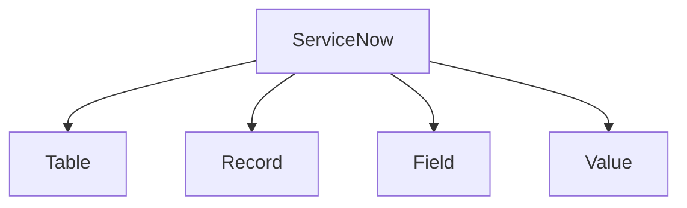

### Resumo
- Table = estrutura
- Record = linha
- Field = coluna
- Value = conteúdo

---

## 2. Hierarquia de acesso

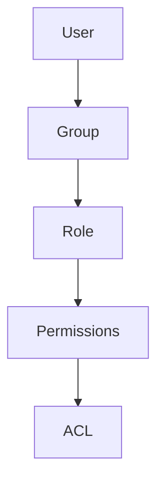

### Resumo
- User acessa a plataforma
- Group organiza usuários
- Role define permissões
- ACL controla o acesso aos dados

---

## 3. Ambientes

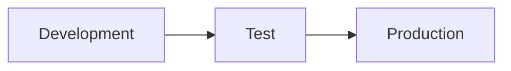

### Resumo
- Development: criar e configurar
- Test: validar
- Production: ambiente real

---

## 4. Dados e relacionamento

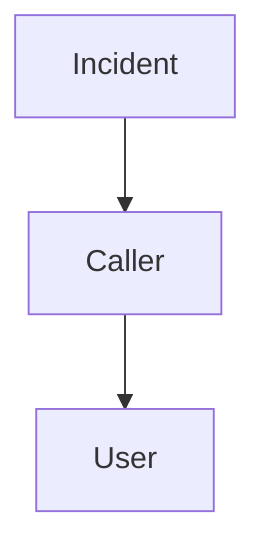

### Resumo
- Reference Field liga uma tabela a outra
- Exemplo: incidente aponta para usuário

---

## 5. Fluxo de importação de dados

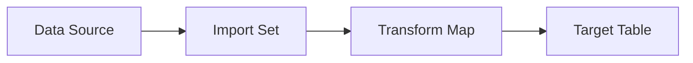

### Resumo
- Importação segue esse fluxo lógico

---

## 6. Portais principais

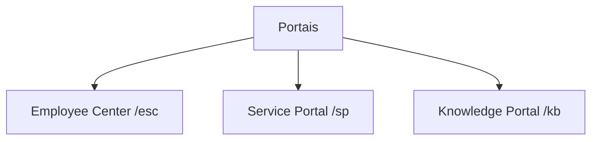

### Resumo
- /esc: portal principal
- /sp: portal de autoatendimento
- /kb: portal de conhecimento

---

## 7. Service Catalog

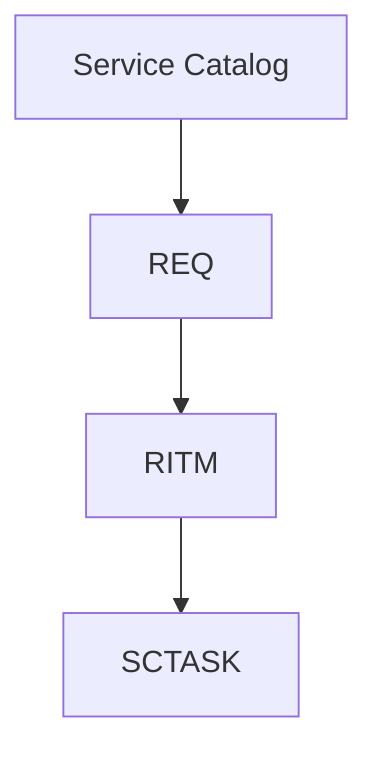

### Resumo
- REQ = pedido completo
- RITM = item solicitado
- SCTASK = tarefa de atendimento

---

## 8. Knowledge Management

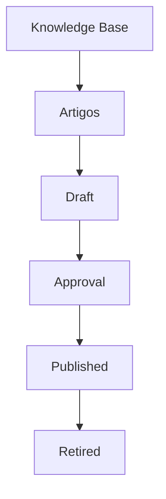

### Resumo
- Conteúdo é organizado em Knowledge Bases
- Artigos seguem um ciclo de vida

---

## 9. Automação e notificações

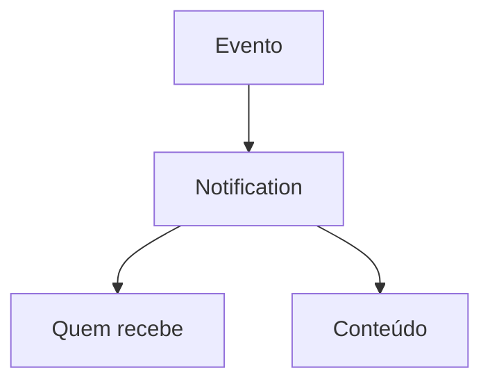

### Resumo
- Notification envia mensagens automáticas
- Pode ser acionada por evento, atualização ou criação

---

## 10. Scripting e lógica

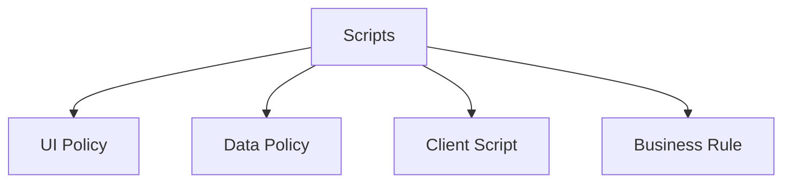

### Resumo
- UI Policy = interface
- Data Policy = dados
- Client Script = navegador
- Business Rule = servidor

---

## 11. Segurança

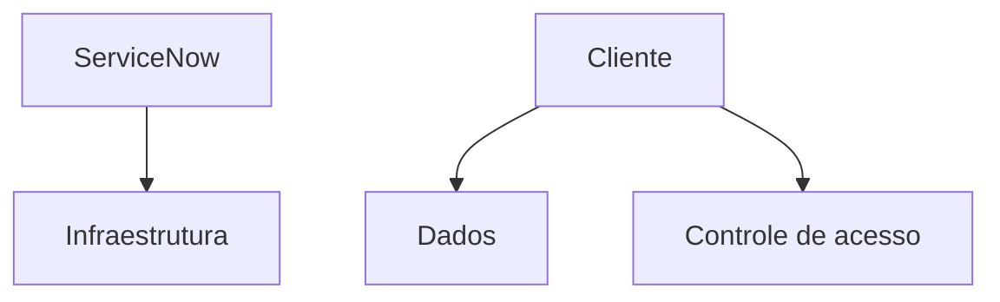

### Resumo
- ServiceNow cuida da plataforma
- Cliente cuida dos dados e da governança

---

## 12. Transporte de alterações

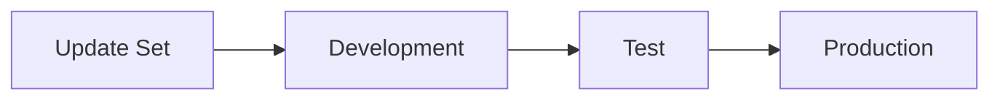

### Resumo
- Update Set agrupa mudanças para mover entre ambientes
